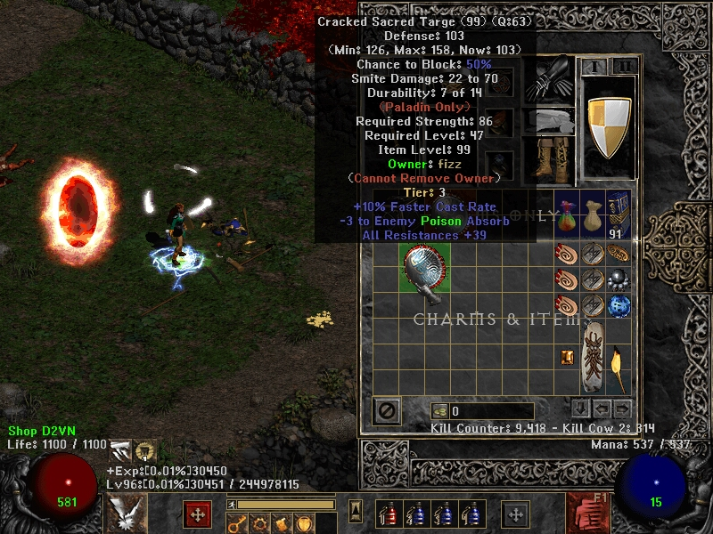

# Tiered Base Item

## Introduce

In Diablo 2 Tyrael Mights, there is a big adjustment in Item Bases, also known as Runeword presses. Item Bases is still basically based on the original mechanics of the game, only with the adjustment of more random options when hunting monsters in the map.

<figure><figcaption></figcaption></figure>

## Options Addtional

| (1-30) + to Energy                     | (1 -2 ) + to All Skills                   |
| -------------------------------------- | ----------------------------------------- |
| (1-30) + to Dexterity                  | (1 – 20) +% to Cold Fire Damage           |
| (1-30) + to Vitality                   | (1 – 20) +% to Lightning Skill Damage     |
| (1-500) to Life                        | (1 – 20) +% to Cold Skill Damage          |
| (1-500) to Mana                        | (1 – 20) +% to Poison Skill Damage        |
| (1 – 50) +% Enhanced Defense           | (1 – 25) -% to Enemy Fire Resistance      |
| (1 – 200) + Defense                    | (1 – 20) -% to Enemy Lightning Resistance |
| Damage Reduced by (1 – 200)            | (1 – 20) -% to Enemy Cold Resistance      |
| Magic Damage Reduced by (1 – 150)      | (1 – 20) -% to Enemy Poison Resistance    |
| Damage Reduced by (1 – 10)%            | (1 – 30) +% to Magic Skill Damage         |
| Magic Resist +(1 – 20)%                | (1 – 30) -% to Enemy Magic Resistance     |
| (1 – 5) +%to Maximum Magic Resist      | Increasing Number Summon: (1 – 5)         |
| Fire Resist +(1 – 20)%                 | (1 – 5) – to Enemy Fire Absorb            |
| (1 – 5) +%to Maximum Fire Resist       | (1 – 5) – to Enemy Lightning Absorb       |
| Lightning Resist +(1 – 20)%            | (1 – 5) – to Enemy Cold Absorb            |
| (1 – 5) +%to Maximum Lightning Resist  | (1 – 5) – to Enemy Poison Absorb          |
| Cold Resist +(1 – 20)%                 | (1 – 5) – to Enemy Magic Absorb           |
| (1 – 5) +%to Maximum Cold Resist       | (1 – 5) – to Enemy Physical Absorb        |
| Poison Resist +(1 – 20)%               | (1 – 5) -% to Enemy Fire Absorb           |
| (1 – 5) +%to Maximum Poison Resist     | (1 – 5) -% to Enemy Lightning Absorb      |
| Replenish Life +(1 – 30)               | (1 – 5) -% to Enemy Cold Absorb           |
| Increase Maximum Life (1 – 30)%        | (1 – 5) -% to Enemy Poison Absorb         |
| Increase Maximum Mana (1 – 30)%        | (1 – 5) -% to Enemy Magic Absorb          |
| (1 – 2) + to Random Class Skill Levels | (1 – 5) -% to Enemy Physical Absorb       |
| (1 – 20) +%Increased Attack Speed      | (1 – 20) +% to Physical Skill Damage      |
| (1 – 30) +%Faster Run/Walk             | (1 – 50) +%Bonus to Summon’s Life         |
| (1 – 20) +%Faster Hit Recovery         | (1 – 100) + Bonus to Summon’s Damage      |
| (1 – 15) +%Faster Block Rate           | (1 – 20) -% to Enemy Physical Resistance  |

## Tiered Level

### Tier 2

Item tier 2 will have random 1 options on Options Addtionnal

### Tier 3

Item tier 3 will have random 2 options on Options Addtionnal

### Tier 4

Item tier 4 will have random 3 options on Options Addtionnal

### Tier 5

Item tier 5 will have random 4 options on Options Addtionnal

Notice: All item Tiered will have owner, you cannot trading outside Market Place

## Drop


[wrath-of-the-lich-king.md](../../extra-quest/wrath-of-the-lich-king.md)



[raise-of-uber.md](../../extra-quest/raise-of-uber.md)



[plain-of-souls.md](../../extra-quest/plain-of-souls.md)


