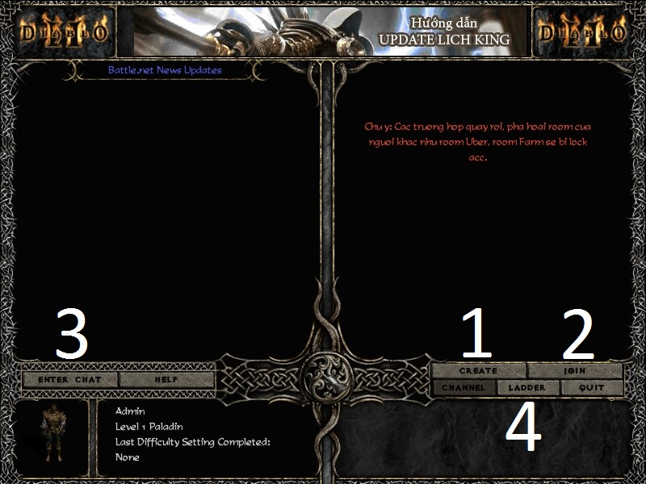
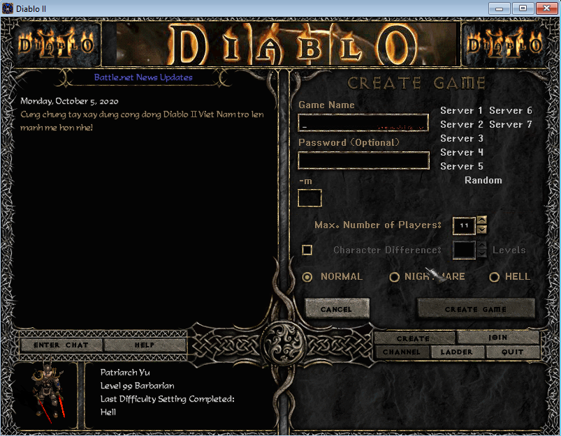
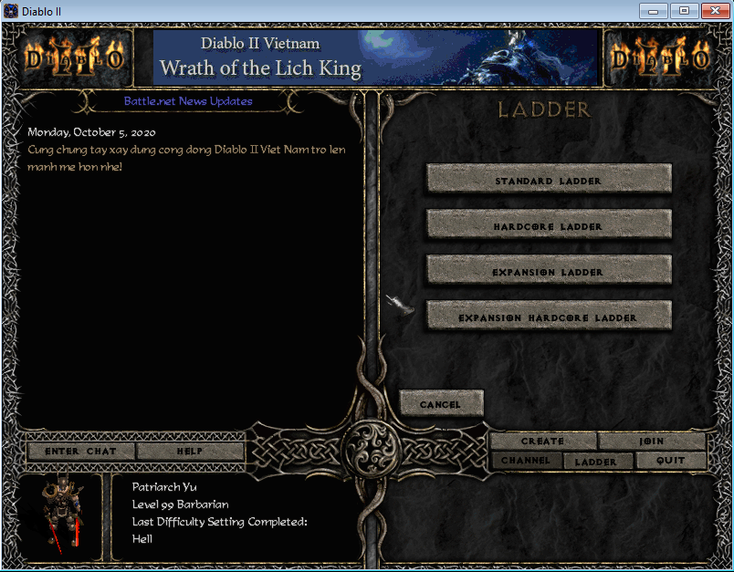
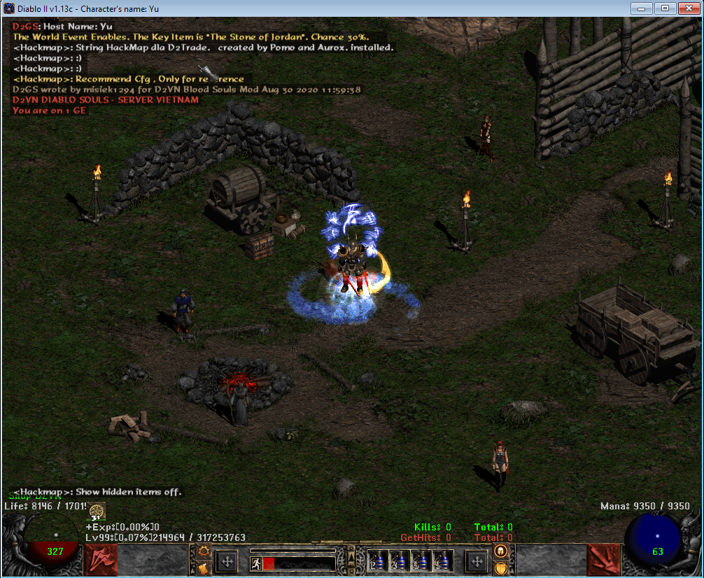

# Tạo nhân vật

## Hướng dẫn tạo nhân vật và tham gia game

Xin chào người phiêu lưu, để bắt đầu,  sau khi tạo tài khoản của bạn. Bây giờ tiếp tới chúng ta tạo nhân vật và tham gia vào game.

### Step 1: Tạo nhân vật


&#x20;S1  -Số 1 Các bạn ấn vào nút CREATE NEW CHARACTER để tạo nhân vật mới


* Tạo nhân vật
* 2 Chon Realm Server

<figure><figcaption></figcaption></figure>

**Bước 4:** Trong đó các bạn cần lưu ý các mục chính từ 1->4

* 1\. Tạo phòng mới, điền tên phòng vô game name và bấm creat game để vào game
* 2\. Tham gia phòng
* 3\. Tham gia phòng chat
* 4\. Xem bảng xếp hạng

<figure><figcaption></figcaption></figure>

<figure><figcaption></figcaption></figure>

<figure><figcaption></figcaption></figure>

<figure><figcaption></figcaption></figure>

<figure><figcaption></figcaption></figure>

* Chúc các bạn chơi Game vui vẻ !! Welcome to Server Diablo2 – VietNam

<figure><figcaption></figcaption></figure>

Như vậy là anh em đã hoàn thành xong việc tạo lấy 1 con tài khoản game rồi. Sau đây có 1 vài lưu ý nhỏ cho anh em:


Khi anh em tạo nhân vật mới sẽ được tặng [CHEST NEWBIE](https://diablo2-vn.com/tm/vat-pham/chest-newbie-va-nhung-dieu-can-luu-y/) ngay khi vô game thay vì phải mua nhé, để mở CHEST anh em lưu ý để túi đồ của mình trống mới mở được nha. Video khởi đầu với CHEST ITEM cho anh em [tham khảo](https://www.youtube.com/playlist?list=PL6cS6t9UKFmXKR71uJ0sre1bF1-75KdUY)

* Tất nhiên là nó chỉ áp dụng khi đã mở Server được 3 tháng, còn đối với Server mới thì điều này không áp dụng lên


* Video khởi đầu với CHEST ITEM cho anh em [tham khảo](https://www.youtube.com/playlist?list=PL6cS6t9UKFmXKR71uJ0sre1bF1-75KdUY)
* Khi chưa có đồ :\
  Rủ bạn bè đi chung , vừa nhiều exp lên level nhanh khi kill quái , vừa nhàn mà ít bị chết , tiết kiệm thời gian cực lớn. Rủ nhau đi chung làm quest đê được bonus nhưng chỉ số sức mạnh.\
  Bạn được them 12 điểm skill , 15 điểm start point , 30 res all , 3 lần socket đồ và vài rune cho 1 char (character) khi làm hết các quest normal , night , hell

1. Hãy nghĩ ngay đến cow hell để kiếm item có socket ép per toza vào tăng %MF
2. Đủ item (áo + nón ) socket per toza là ta có MF kha khá , bạn có thể tìm mephisto hell xin nó ít đồ , bạn có đi vài nghìn lần mephiso hell cũng xứng đáng , nó luôn được các mem yêu thích vì khả năng drop đồ rất đáng yêu và dễ đánh.(bạn có thể đánh mephisto 1 mình mà không mất máu , hãy hỏi các bạn trong game chỉ cho nhé , cái này vào game chỉ đơn giản ,5’ thôi, nói ra thì dài dòng lắm.
3. Bạn có thể đi AT (accident tuner) : ở wp (waypoint) 4 – lost of city act2 hell : đây là vùng area 85 phù hợp cho sorc cold vì immu cold không có , chỉ thi thoảng có 1 con boss immu cold, bạn bỏ qua nó là xong , hoặc cho merc (đệ tử) giết nếu nó đủ khả năng. Area 85 là gì và buid merc thế nào mình sẽ nói sau.

* Không nói nhiều, anh em cày nguyên bài này là thành Pro (có Clip đầy đủ)\
  Lưu ý: Mình sẽ giúp anh em khởi đầu cần có những gì và không có những gì nhé !!!\
  Chúc anh em khởi nghiệp thành công!!
* Farm ở các map 85, anh em cứ chịu khó đi, 100 – 200 room chưa có gì cũng đừng nản, có những lúc mình chạy cả 5-600 room được 2-3 món ngon là hoàn toàn bình thường.\
  -> Mục tiêu: chúng ta sẽ farm kiếm các trang bị hịn hơn để build
* Rồi khi build các char khá là khoẻ rồi thì chúng ta chuyển qua tập trung farm và biết đâu quá trình farm chúng ta lại có nhiều đồ ngon hơn để sẵn sàng hướng đến mục tiêu chinh phục tiếp theo là map SALVATION 1. (Mở Extra Quest trong Quest - Bấm nút Q và chọn vào biểu tượng Extra Quest gần nút ? để xem).
