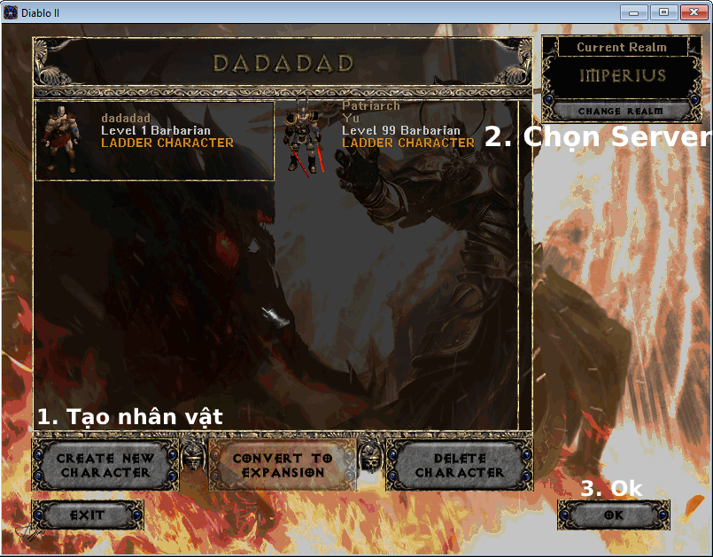
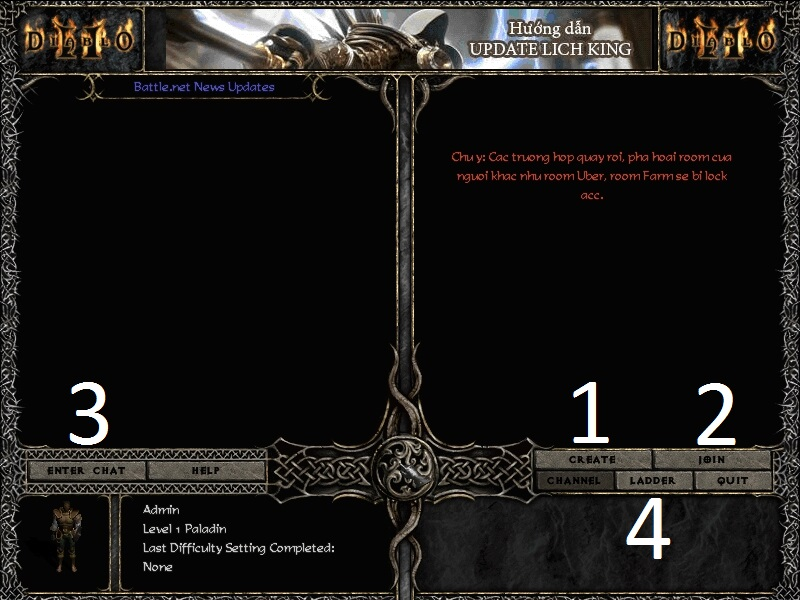
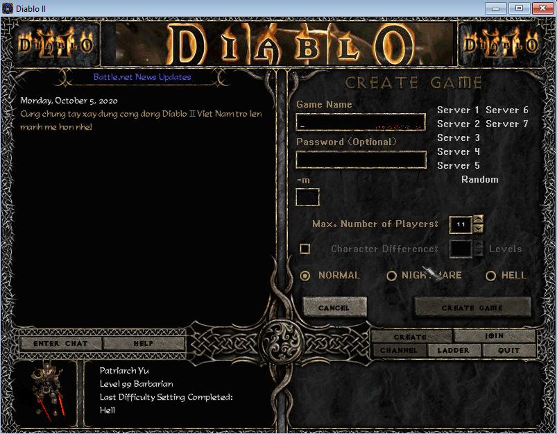
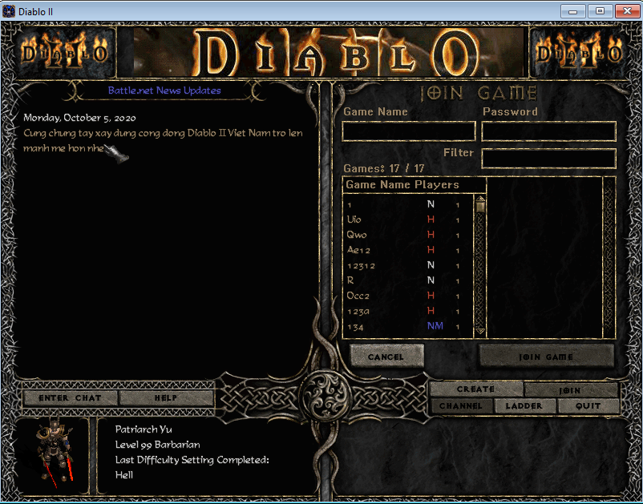
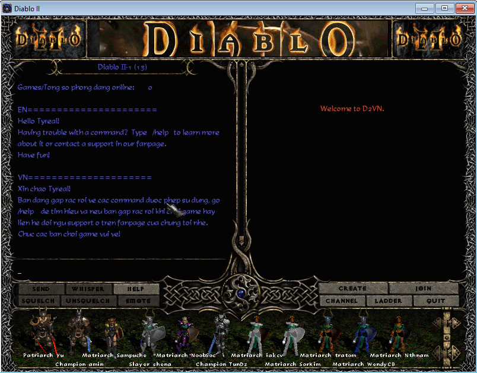
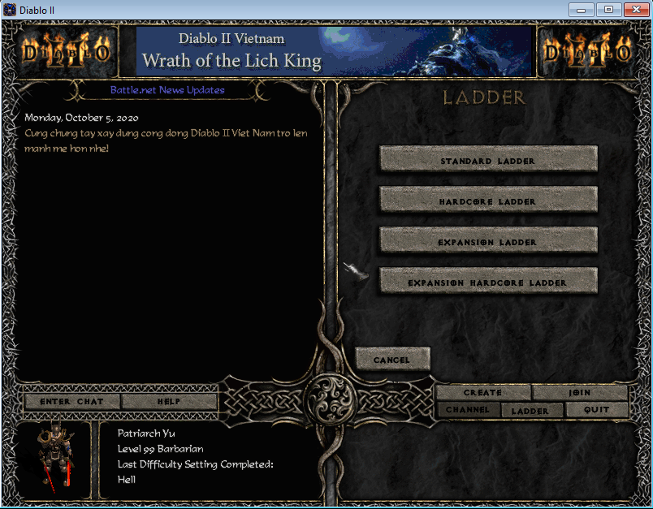
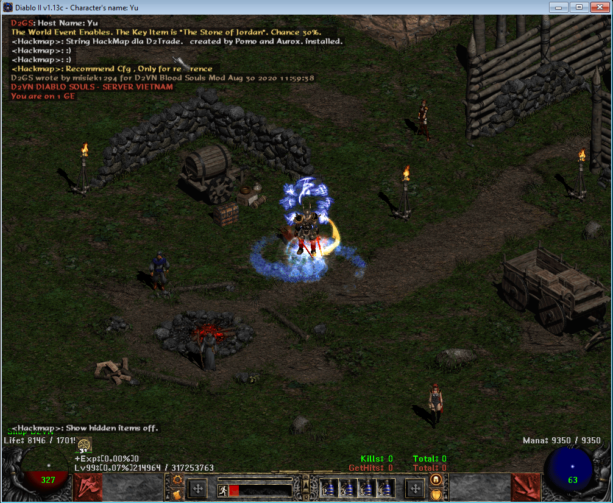

# Tham gia InGame

## Hướng dẫn tạo nhân vật và tham gia game

Xin chào người phiêu lưu, để bắt đầu,  sau khi tạo tài khoản của bạn. Bây giờ tiếp tới chúng ta tạo nhân vật và tham gia vào game.

### Step 1: Tạo nhân vật


Số 1 Các bạn ấn vào nút CREATE NEW CHARACTER để tạo nhân vật mới

Số 2 Là để chọn Realm (Server) tham gia vào game. Hiện tại đang là S22


<figure><figcaption></figcaption></figure>

### Step 2: Tạo room tham gia game

Người chơi có thể tạo hoặc tham gia vào các phòng chơi để cùng nhau chiến đấu, hoàn thành nhiệm vụ và tiêu diệt quái vật. Điều này tạo ra một trải nghiệm hợp tác thú vị.


1\. Tạo phòng mới, điền tên phòng vô game name và bấm creat game để vào game

2\. Tham gia phòng

3\. Tham gia phòng chat

4\. Xem bảng xếp hạng


<figure><figcaption></figcaption></figure>

<figure><figcaption></figcaption></figure>

<figure><figcaption></figcaption></figure>

<figure><figcaption></figcaption></figure>

<figure><figcaption></figcaption></figure>

<figure><figcaption></figcaption></figure>


Chúc các bạn chơi Game vui vẻ !! Welcome to Server Diablo 2

