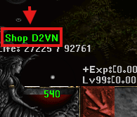

# Điều Khoản Cộng Đồng

## QUY ĐỊNH

D2VN là máy chủ Game Diablo 2 duy nhất tại Việt Nam còn phát triển dành cho tất cả Player Việt Nam cũng như Player toàn Server SEA. Player khi tham gia Server D2VN cần tuân thủ các quy định sau :&#x20;

1. Không bàn luận tới chính trị gia, bang phái, tôn giáo , nhà nước, v.v....
2. Không gây gổ, xúc phạm nhân phẩm, danh dự, miệt thị ( Body Shaming ) của Player khác ( kể cả các Player Global )
3. <mark style="color:red;">Không đặt tên nhân vật liên quan đến các nhân vật tầm cỡ, tên các lãnh đạo, ADMIN, Mod, Anh hùng dân tộc, Lãnh đạo Đảng, Nhà nước CHXHCN Việt Nam. ( Nếu phát hiện sẽ Ban ngay lập tức )</mark>
4. Mọi hành vi trục lợi lỗi bug - hack, tung tin giả gây hoang mang người chơi khác, Lạm dụng tên MOD - ADMIN lừa đảo chiếm đoạt tài sản của người chơi khác, làm ảnh hưởng đến Server sẽ bị xử lý 1 lần duy nhất là <mark style="color:red;">BAN VĨNH VIỄN TÀI KHOẢN.</mark>
5. GM chỉ có quyền lợi giúp đỡ người chơi, không tra hỏi thông tin tài khoản ( Trường hợp Lừa Đảo xảy ra BQT Game không giải quyết ).
6. Người chơi tự bảo vệ thông tin tài sản cá nhân của mình, các trường hợp nhờ hỗ trợ mất tài khoản không rõ lý do sẽ không giải quyết.
7. Khi giao dịch vật phẩm có giá trị trong game cũng như bán Account hoặc các item Phẩm Chất quý nên thông qua GM làm trung gian giao dịch trực tiếp, nếu phát sinh vấn đề sau giao dịch, các vật phẩm không đúng quy định có thể bị thu hồi mà không cần báo trước hay đền bù cho người chơi.
8. GM chỉ hỗ trợ người chơi qua 1 kênh là [**Discord**](https://discord.d2tm.com)  ( sử dụng kênh support-ticket để được hỗ trợ nhanh nhất có thể ). 
9. Khi chơi game cần tuân thủ đúng pháp luật nước CHXHCN Việt Nam, không nên giao dịch các loại vật phẩm ảo bằng tiền thật, Trường hợp lừa đảo, Scam xảy ra BQT D2VN không giải quyết.
